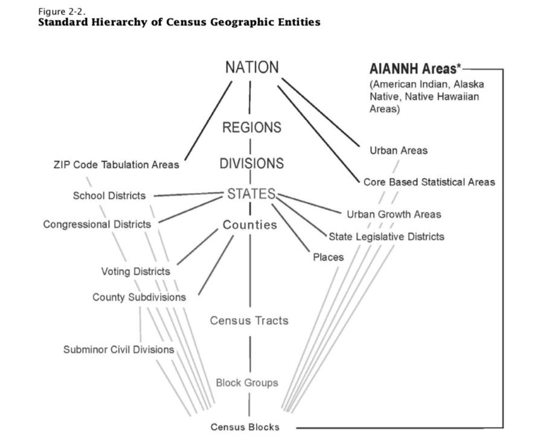

:title: Dental Demographics
:date: 2018-12-31
:modified: 2019-02-07
:category: Projects
:slug: dental-demographics

Dental Demographics
===================

My brother is graduating from dental school in 2019, so he is
interviewing with dental practices for a potential place to work.
The impetetus for this project was discussions with him on the
problem of finding an optimal location for a dental practice.

Since dentists are using paid by the amount of dental care they
actually provide, and the amount of patients each dental practice
cares for varies from practice to practice, a dentist's income is
very location-dependent.

All of the code for this project can be found on Github_.

.. _Github: https://github.com/mmallicoat/dental-demographics

American Community Survey
-------------------------

I used demographic data from the American Community Survey (ACS)
published by the US Census Bureau. This survey contains data from
a five-year period, 2012–2016. The attributes include age, sex,
race, occupation, veteran status, insurance benefits, and others.

The finest granularity of the geographic component is the Public
Use Microdata Area (PUMA). These are generally small geographic
regions (of no fewer than 100,000 people, in order to maintain
anonymity and statistical credibility). The boundaries of the
PUMAs do not cross state or county lines, so the data can be
aggregated at that level. The boundaries also do not cross the
Census Blocks and Census Tracts used in the Decennial Census. [#]_

   The PUMA falls between the County and Census Tract granularities.

The ACS replacted the census "long form" in 2010. It contains
many more variables than the Census, but only for a sample of
the population rather than it entire. The data is aggregated and
published annually, which provides a more up-to-date snapshot than
the Census.

The ACS data is published online and is available by HTTP or FTP.

.. [#] They do, however, cross the boundaries of ZIP codes.

Income and Age
--------------

The problem in question is which geographic regions provide the best
opportunity for the placement of a dental practice.

Most dental practices in the United States are privately owned.
A sole dentist or partnership of dentists will finance
the opening of a new dental practice themselves. Placing the
practice in a location that it will be profitable is an important
consideration.

Areas with higher incomes will spend more on dental care than
lower incomes. This makes sense, since the socialized medical
programs in the US (e.g., Medicaid and Medicare) do not generally
provide dental coverage, so the payments for dental services
come from insurance companies and from the patient out-of-pocket.
Areas with older populations will spend more on dental care, since
older people have more dental problems and also because of the
positive correlation between age and income/wealth. So, these are
two demographic attributes that we interested in when considering a
location.

Using the datasets for the states of Kansas and Missouri, I calculated some
statistics. Below is a snippet.

====== ===== =========== ======================== =========== ========================= ===============
State  PUMA  Population  Median Household Income  Median Age  Percent Aged 60 or Older  Dental 
                         (2016 Dollars)                                                 Practice Count
====== ===== =========== ======================== =========== ========================= ===============
20     100   109,867     $41,200                  41          26.7%                     NA
20     200   147,564     $42,318                  41          25.7%                     NA
20     300   134,983     $32,714                  26          12.2%                     NA
20     400   122,120     $42,564                  37          20.5%                     NA
20     500   161,762     $40,129                  33          16.5%                     63
20     601   116,104     $81,513                  38          18.3%                     81
20     602   153,179     $65,904                  37          22.5%                     152
20     603   158,524     $69,349                  34          13.6%                     79
20     604   144,839     $106,734                 39          18.9%                     171
20     700   116,206     $26,172                  29          15.3%                     NA
====== ===== =========== ======================== =========== ========================= ===============

I also visualized this results using QGIS_.

   Higher median incomes are shown in darker shades.

We see that the highest income areas in these two states are
in the suburbs of Kansas City and Saint Louis, on the western
and eastern borders of Missouri. There are also slightly higher
incomes in the suburbs of Topeka (in north–central Kansas) and
Wichita (in south–central Kansas).

   Higher median ages are shown in darker shades.

The median age is generally higher in more rural regions. In the
areas where large universities are located, we see a much lower
median age than elsewhere. The youthful patches on the plot can be
explained by Kansas State University in Manhattan, the University
of Kansas in Lawrence, the University of Missouri in Columbia, and
Missouri State University in Springfield.

An outlier in income and age is southwest Kansas: it has unusually
high incomes and unusually young population for a rural area.
My theory is that this is due to the petrolium industry in this
region, attracting young workers and paying relatively high wages.
[Or cattle/livestock/beef industry??]

.. _QGIS: https://en.wikipedia.org/wiki/QGIS

Competition
-----------

A third variable is the number of dental practices already
operating the region. The more dental practices there are, the
more competition, leading to less utilization of the capacity of
each dental practice.

I scraped the listings of dentists and dental practices from an
online directory in order to assess this. Since I was interested
in the area of Johnson County, Kansas, I collected listing from
the region around Lenexa, Kansas, a suburb of Kansas City,
Missouri, located in the center of Johnson County.

Given the address of each dental practice, I used the `Open Street
Map`_ Nominatim_ API to geocode each location, looking up the
latitude and longitude coordinates for each street address.

The shapefiles_ provided by the Census Bureau for the PUMAs
contain the boundaries of the geographic regions. Using the
``fiona`` Python library, we can easily open and manipulate
shapefiles. In conjunction with the ``shapely`` library, we can
find which PUMA each of the dental practices is located in, via
its coordinates.

After removing duplicate locations from our list of dental
practices, we can then tabulate the number in practices in each
PUMA within Johson County, Kansas.
(Per my brother, a good region for a practice has no less than
2000 [?] patients for dental practice.)

In QGIS, we can join these practice counts with the population
data embedded in the PUMA shapefiles. The ratio of population to
the number of dental practices can be calculated and **overlayed
on our income chart.**

   Population per dental practice in Kansas City area

.. Add discussion of practice ratios. How many is good?

.. _shapefiles: https://en.wikipedia.org/wiki/Shapefile
.. _`Open Street Map`: https://www.openstreetmap.org
.. _Nominatim: https://wiki.openstreetmap.org/wiki/Nominatim

Future Directions
-----------------

Analysis of dental insurance providers in the area and what they
will pay for dental care.

The dental practice addresses scraped from the online directory
were quite dirty:

* Dentists listed multiple times at different practices
* Addresses for practices with the wrong city or ZIP code listed

There also is little trust in the listings being current or
complete. In the future, there may be better sources for this
information, such as lists of in-network dental practitioners
published by insurance companies.
